# 16×16 Cyberpunk — LED matrix art

Pixel art and animation for a 16×16 RGB LED panel (WS2812B / HUB75 / Pixoo /
etc.) — a Japanese-cyberpunk pair, a Matrix rain loop, two landscapes,
the Eye of Sauron, a colour-cycling TIE fighter, a 30-second skull, a scrolling name-and-sunset banner, a
two-minute samurai saga, and two lanterns.
Each piece is generated from code, so the drawing stays editable and every
export format is rebuilt from one source of truth.

## The pieces

### Torii — `generate_torii.py`

A neon torii gate silhouetted against a rising red sun, framed by a dark
skyline with cyan windows and a wet neon-lit street.

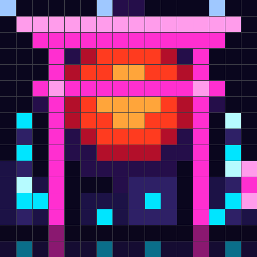

### Oni — `generate_oni.py`

A red oni glaring out of the dark: bone horns, heavy brows, blown-out cyan
eyes, and a tusked grin, with magenta and cyan rim lights tracing the jaw.

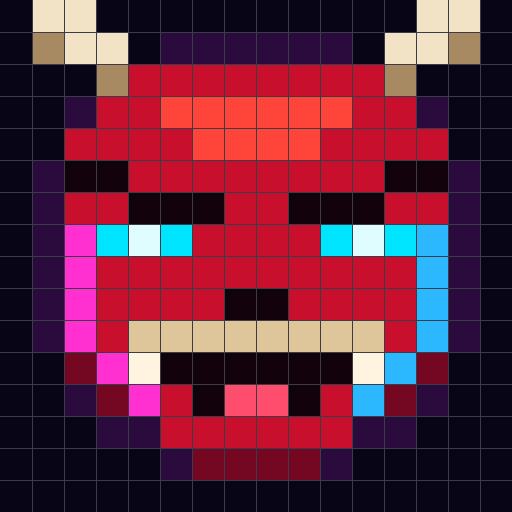

Animated: 24 frames at 90 ms (2.2 s loop). The glare breathes from steady cyan
up to a white-hot core and the halo swells with it, the two neon rim lights
stutter out of phase like failing tubes, a single frame tears the eye rows
sideways, and the oni blinks once per loop.


### Matrix rain — `generate_matrix.py`

Sixteen columns of falling code: a blown-out leader pixel with a green trail
fading behind it, and the glyph-flicker of characters changing mid-fall.
32 frames at 80 ms (2.6 s loop).

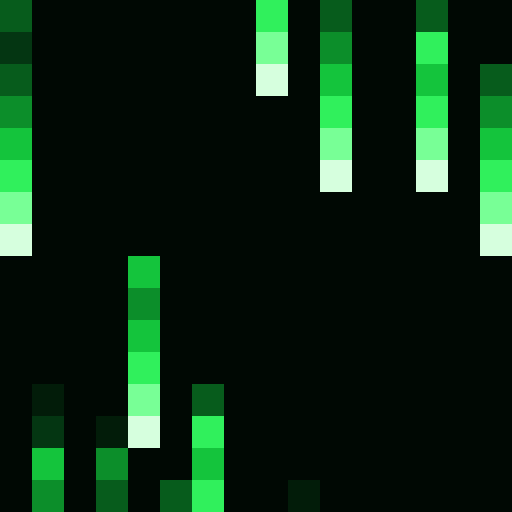

This one is procedural — each frame is drawn from the column state at time
`t` rather than authored pixel by pixel. Column heads travel a 32-row cycle
at whole rows per frame, so every column is back where it started on the last
frame and the loop closes with no visible seam. The flicker noise is hashed
from `(x, y, t)` for the same reason: it repeats with the loop instead of
popping at the wrap. `matrix16.png` is frame 0, if you want a still.

### Moonlit hills — `generate_moon.py`

A full moon over two rolling hills with a lone tree on the far ridge. Wisps of
cloud drift across the sky, stars twinkle out of phase with each other, and
fireflies blink above the ridgeline. 32 frames at 120 ms (3.8 s loop).

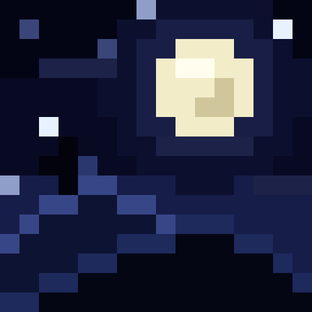

Only one wisp runs at a height that crosses the disc, so the moon is clear for
half the loop and veiled as that wisp drifts past — a cloud over the moon
brightens rather than darkens, which is what sells it as thin cloud. Drift is
one pixel every other frame, carrying a wisp exactly 16 px over the loop so it
wraps seamlessly. The ridgelines are hand-written per column: at 16 px wide,
placing each crest by hand beats any curve formula.

### Wooded forest — `generate_forest.py`

Layered trunks receding into a misty gap of light, a dappled canopy overhead,
and two shafts of sun cutting down between the trees. Motes drift up through
the beams, the canopy stirs, and a leaf falls the height of the panel each
loop. 32 frames at 110 ms (3.5 s loop).

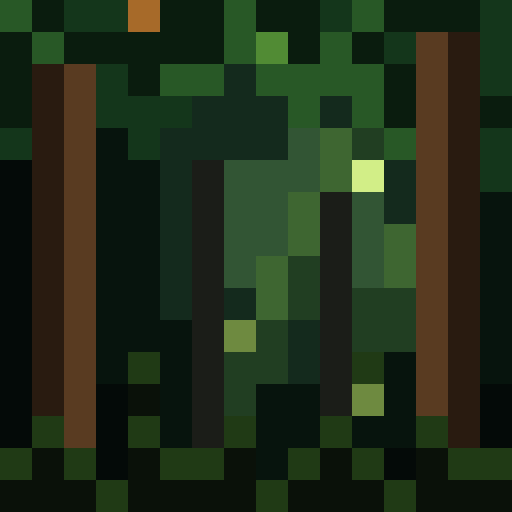

Depth comes from two things: near trunks are warm and dark while far ones
desaturate toward the mist, and the mist itself shades by distance from the
gap so light falls off in every direction instead of banding by row. The leaf
texture is hashed on position alone — hashing it on the frame number too made
the entire canopy boil — so wind is just a handful of pixels stirring a step
brighter per frame.

### The Eye — `generate_eye.py`

The lidless eye wreathed in flame above the dark spire of Barad-dûr. Fire
licks around the rim, the glow behind it swells, and the slit pupil sweeps
left and right, searching. 24 frames at 100 ms (2.4 s loop).

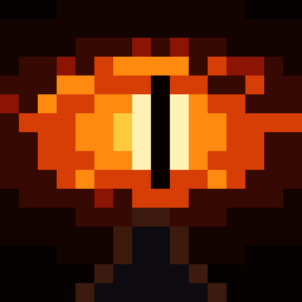

The eye is a lens — the overlap of two circles — rather than an ellipse,
which is what gives it points at the corners instead of reading as a blob.
The pupil is a single pixel wide with white-hot flanks across the middle
rows only: two pixels of black swallowed the eye, and flanking its full
height turned the iris into a bright capsule.

### TIE fighter — `generate_tie.py`

A TIE silhouette cycling through the spectrum: 32 frames at 110 ms (3.5 s
loop), one full turn of the colour wheel.

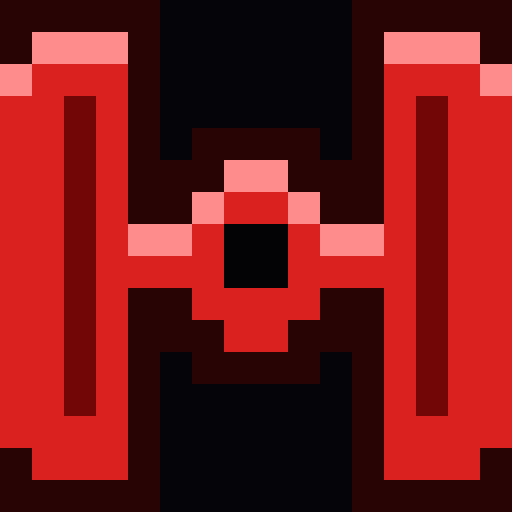

The most literal palette animation in the set — the geometry never changes at
all. Every frame draws the same mask and only rotates the hue, so the hull,
its rim light, the wing spars and the backglow all stay in step because they
are derived from one hue value per frame.

A TIE is the Star Wars shape that survives 16 px: two slab wings and a ball,
all straight lines and hard corners. A Vader helmet was the first attempt and
had to be abandoned — at this size the dome, lenses and grille collapse into a
generic face.

### Skull — `generate_skull.py`

Thirty seconds in four movements: the skull sweeps twice round the colour
wheel, then matrix rain falls through it and every pixel the rain touches
stops being skull and drops away as code; a stretch of rain alone; then a
second sweep with the skull re-forming in its wake. 250 frames at 120 ms —
30.00 s exactly.


| Time | What happens |
| --- | --- |
| 0.0 – 18.0 s | Skull, two full turns of the colour wheel |
| 18.0 – 22.8 s | Rain sweeps down, dissolving the skull as it passes |
| 22.8 – 25.2 s | Rain only |
| 25.2 – 30.0 s | Second sweep, skull re-forming behind it |

The rebuild is what makes it loop: the last frame lands on the first, so it
runs forever without a seam. The dissolving sweep trails its tail *behind*
the head, covering what it just erased; the rebuilding sweep trails *ahead*
of the head instead, so the code reads as being consumed into the skull
rather than painted over it. Rain fades out over the final twelve frames, or
it would pop at the wrap.

Long animations skip the RGB888 array in the header — at 250 frames it
doubles a file no microcontroller would play from anyway. `skull16_anim.h`
is 535 KB with RGB565 alone.

### Scrolling name and sunset — `generate_name.py`

“THEA & ROMA” scrolling right to left in chunky geometric caps — pink body,
white inline, deeper pink edge behind, on baby blue — and then, once the name
has passed, the sky turns and a sunset flows by: gradient sky, a sun sitting
on the horizon, silhouette hills, palms and birds, before fading back to baby
blue for the loop. 231 frames at 90 ms (20.8 s per pass).

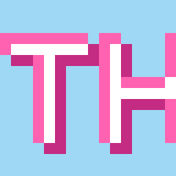

The whole strip, for checking letterforms and spacing without scrubbing the
animation (`name16_strip.png`, not a panel file):

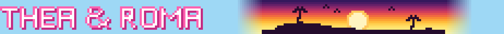

The whole banner is laid out once as a 231 px strip and each frame is a 16 px
window sliding along it and wrapping, so the scroll is seamless by
construction and the loop is exactly as long as the strip is wide. Change
`TEXT` and the frame count follows automatically.

The strip is built in RGB rather than palette characters, because the sky
gradients in two directions at once: down the rows from night purple to gold,
and across the columns as baby blue turns into sunset and back. The land, the
palms and the birds are all one flat colour — a silhouette needs no shading,
only a sky bright enough behind it. The ridge runs flat for the first and
last few columns so the land slides into frame from below rather than
appearing mid-air.

Every glyph is drawn with 2px strokes, which is what gives the inline pass an
interior to paint: a pixel is white unless it sits on a top or left edge, so
each stroke comes out pink on the outside and white through the middle. The
ampersand is wider than the letters — at 9 columns it collapsed into a blob,
and its tail needs room to swing clear.

### Saga — `generate_saga.py`

Two minutes in medieval Japan: a skeleton raised into a samurai by purple
magic, then fire. 1000 frames at 120 ms — 120.00 s exactly, looping.

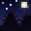

| Time | Movement |
| --- | --- |
| 0 – 15 s | Castle keeps on the ridge under a cold moon |
| 15 – 34 s | A skeleton rises out of the ground, sockets lighting violet |
| 34 – 60 s | Purple magic spirals in, the orbit tightening as it goes |
| 60 – 75 s | The vortex closes, a white flash, and a samurai stands there |
| 75 – 97 s | Fire erupts; he steps aside as it takes hold |
| 97 – 112 s | The keep burning, the samurai before it |
| 112 – 120 s | Fire dies, night returns, and the loop closes |

The magic orbits on a tilted ellipse drawn in two passes — once before the
figure and once after — with the sign of `sin(angle)` deciding which pass a
mote belongs to, so half the swirl passes behind the body. The flash at the
midpoint is what covers the swap from bones to armour. Keeps stay flat dark
silhouettes with only their rooflines taking the firelight: washing the whole
body in glow made them vanish into a red sky, and since the samurai's armour
is dark too, he walks out of centre frame as the fire rises so the two never
overlap.

At 1000 frames this is the largest piece here — 2.1 MB of C header, 463 KB of
GIF.

### Lantern — `generate_lantern.py`

A chochin hanging on black: dark caps, ribbed paper, a kanji brushed across
the middle, a tassel below, and a dim orange candle guttering inside.
96 frames at 90 ms (8.64 s loop).

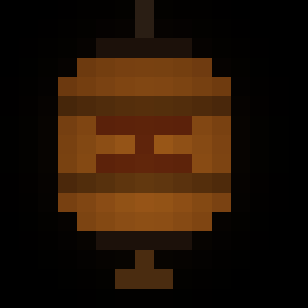

The flicker is the whole piece. It is built from four sines whose cycle counts
over the loop are whole numbers (3, 7, 13, 23), which reads as irregular — no
two frames alike — while returning exactly to its starting value at the wrap.
Two hand-placed gutters dip it further at uneven intervals, and the flame
leans about half a pixel as it burns, so the glow moves instead of just
dimming like a lamp on a dial.

This is the one piece on pure black rather than near-black. It works here
because the halo does the work: the spill on the surrounding pixels breathes
with the flame, so the panel never looks switched off.

### Stone lantern — `generate_toro.py`

An ishidoro standing in a garden at night: hoju finial, curved kasa roof with
its eaves turned up at the corners, a round moon window cut through the
firebox, then platform, post and base, with moss at the foot and grass either
side. 80 frames at 100 ms (8.0 s loop).

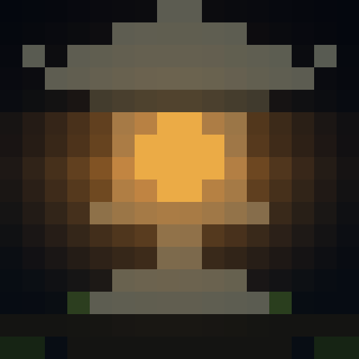

Where the paper lantern *is* the light, this one is only lit by it — so the
piece is built the other way round. Every pixel is drawn in its own stone,
moss or earth colour first, and a second pass warms each one by how close it
sits to the firebox. Surfaces below the window take more of it than those
above, because the roof caps the light: that asymmetry is what makes a heavy
grey object read as lit from inside rather than merely tinted orange.

The window started as a plain rectangle and read as a flat amber slab. Cutting
it round — the moon window these lanterns actually carry — fixed it at no cost
in pixels.

## Files

Each piece `<name>` (`torii16`, `oni16`, `matrix16`, `moon16`, `forest16`,
`eye16`, `tie16`, `skull16`, `name16`, `saga16`, `lantern16`, `toro16`)
exports the same set:

| File | What it is |
| --- | --- |
| `<name>.png` | The actual 16×16 image — load this on the panel |
| `<name>_preview.png` | 32× blow-up with a grid, for eyeballing pixels |
| `<name>.json` | `rows_hex` (16 strings of 16 `RRGGBB`) + `pixels_rgb` nested arrays |
| `<name>.h` | C header with `<name>_rgb888[256]` and `<name>_rgb565[256]` |

Animated pieces add:

| File | What it is |
| --- | --- |
| `<name>_anim.gif` | The 16×16 loop |
| `<name>_anim_preview.gif` | 32× blow-up of the loop |
| `<name>_anim.json` | `frames_rows_hex` plus `frame_count` and `delay_ms` |
| `<name>_anim.h` | `<name>_anim_rgb888[frames][256]`, `<name>_anim_rgb565[frames][256]`, and `*_FRAMES` / `*_DELAY_MS` defines. Past 64 frames the RGB888 array is omitted |

On a microcontroller use the RGB565 array and step one frame per
`*_DELAY_MS`; the RGB888 copy is there for hosts that want the full range.

`pixelart.py` holds the shared `Canvas` — drawing primitives (`put`, `rect`,
`disc`, `ring`, `mirror_x`) over a character grid plus a palette, and the
exporters for both the stills and the animation.

All data is row-major from the top-left pixel.

## Fitting it to your panel

Every file here is genuinely 16×16 — `file tie16.png` reports `16 x 16`, and
the PNGs carry no DPI metadata, so anything that displays them larger is
scaling them for viewing. Panels still disagree about *order*: some start from
another corner, some are rotated, and most DIY 16×16 boards are wired
serpentine, where every other row runs backwards.

To find out which, display `probe16.png` (`generate_probe.py`) — a pattern
where no rotation, flip or wiring order produces the same picture as any
other:

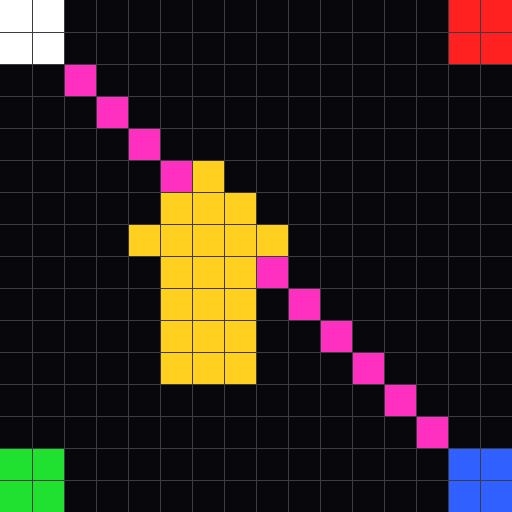

| What you see | What it means |
| --- | --- |
| White block somewhere other than top-left | That corner is the origin; the corner colours tell you which rotation or flip |
| Arrow points down or sideways | Rotation |
| Arrow mirrored but corners correct | A flip, not a rotation |
| Diagonal is a zigzag, rows shuffled | Serpentine wiring |
| Pattern is cropped or fills oddly | Whatever loads the file is scaling it, not the file itself |

Then bake the correction in with `panelfit.py`:

```sh
python3 panelfit.py tie16 --serpentine
python3 panelfit.py moon16 --rotate 180 --flip-x
python3 panelfit.py eye16 --serpentine --rotate 90 --out panel
```

It writes `<name>_fit.png` (and `_fit.gif` for animated pieces) plus raw
binaries — RGB888 at 3 bytes per pixel and RGB565 at 2 bytes big-endian,
frames concatenated — for setups that want to push bytes straight at a strip.

One shortcut: the TIE fighter is mirror-symmetric, every row a palindrome, so
serpentine wiring cannot scramble it. If *that* piece looks wrong on your
panel, the cause is rotation, cropping or scaling, not row order.

## Design notes for LED panels

- Around a dozen colors per piece, all far apart in hue and brightness — LEDs
  crush subtle gradients, so anything more would smear together.
- Large shapes get a 3-step ramp (the sun's deep red → orange-red → amber
  core) so they still read as round after the panel's gamma flattens them.
- Hues are separated, not just brightnesses: torii magenta against sun orange,
  cyan eyes against a red face. Both survive at low panel brightness.
- The oni's magenta/cyan rim lights do the work an outline would do — at 16×16
  there is no room for a border, but two lit edges still detach the silhouette
  from the background.
- Backgrounds are near-black rather than pure black, which keeps dark areas
  from looking like dead pixels.
- The rain is the one piece built on brightness alone rather than hue: a
  single green with a steep 8-step ramp. The first two steps drop hard, since
  a gentle fade off the leader reads as a fat blur rather than a falling
  glyph once the panel's gamma gets hold of it.
- Because the art is a character grid over a palette, animation is mostly
  palette animation: the geometry stays put and only the meaning of its colors
  changes per frame. The blink is a palette swap too — a 1px-tall eyelid would
  read as noise, so the eyes simply drop to brow-black.
- Silhouettes need something bright behind them. The tree on the moonlit hills
  only became visible once the horizon band was lifted and its moon-facing
  edge was given a rim pixel — black on near-black is just a hole in the
  panel.
- Shafts of light need width. A one-pixel beam vanishes into the haze it is
  cutting through, so the forest's are two px wide with a brighter leading
  edge.
- Fire is the one place per-pixel noise should re-roll every frame. The same
  trick that ruined the forest canopy is exactly what makes the Eye's rim
  read as flame.
- Fire reads as fire only if its base tops out at orange with flecks of gold.
  Letting the hottest rows run to near-white turned the bottom of the saga
  into a sand bar.
- Keep animation delays a multiple of 10 ms. GIF stores them in hundredths of
  a second, so a 125 ms delay silently becomes 120 ms and the file plays at a
  different length than the exported arrays claim — five seconds adrift over
  a two-minute piece.
- A flat single-colour silhouette needs a rim light along one edge or it has
  no form at all. One edge — running it down the side as well just puts a
  stripe through the shape.

## Editing

Edit the drawing calls in a generator and re-run it; its outputs are
regenerated together.

```sh
pip install Pillow
python3 generate_torii.py    # each script also prints its grid as ASCII
python3 generate_oni.py      # for a quick sanity check in the terminal
python3 generate_matrix.py
python3 generate_moon.py
python3 generate_forest.py
python3 generate_eye.py
python3 generate_tie.py
python3 generate_skull.py
python3 generate_name.py
python3 generate_saga.py    # ~2 min of frames, takes a moment
python3 generate_lantern.py
python3 generate_toro.py
python3 generate_probe.py   # panel calibration pattern
```
